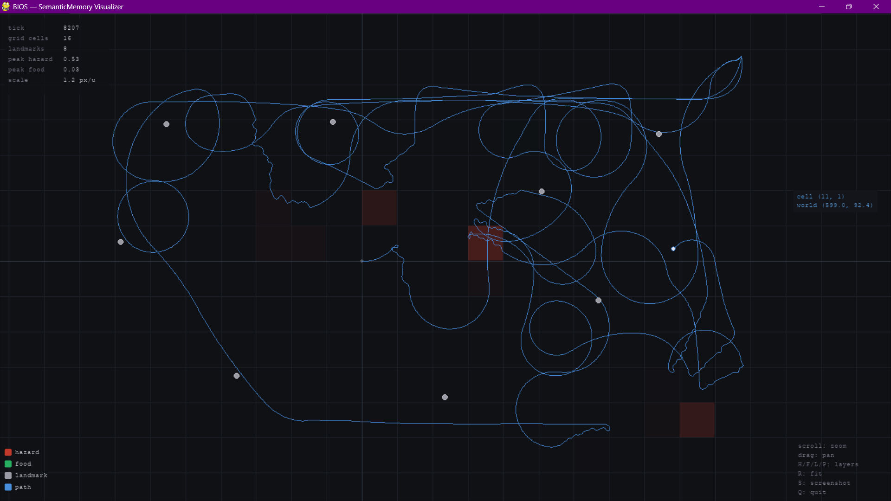
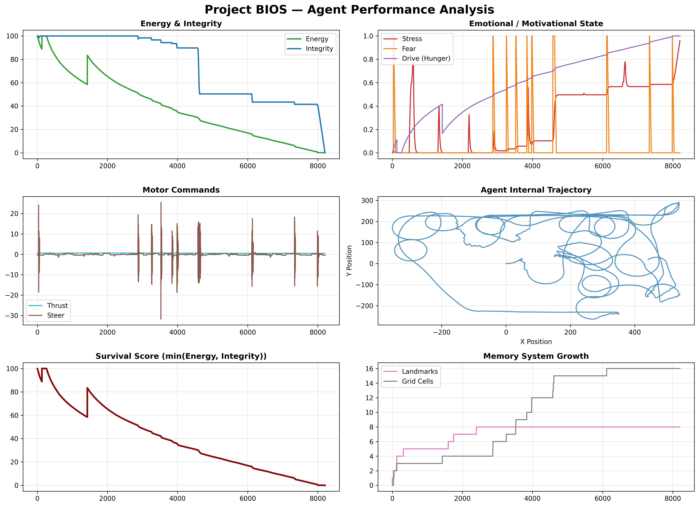
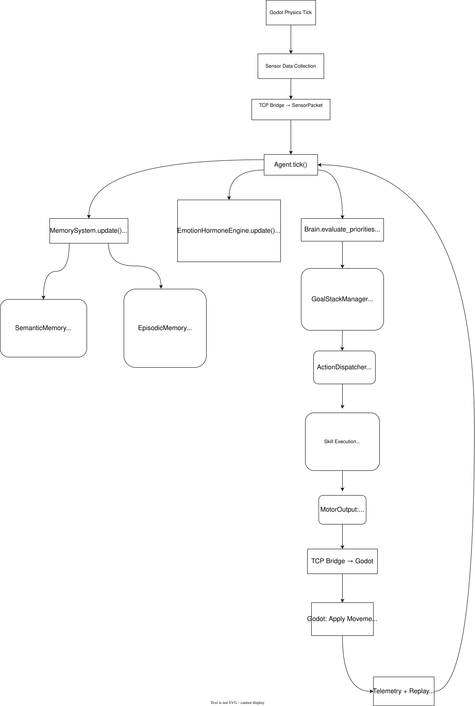

<div align="center">

# 🧠 Project BIOS

> An embodied cognition simulation where behavior emerges from physiology, emotion, memory, and environmental interaction — not scripted behavior trees.

> The goal is **understandable emergent intelligence from first principles**.

[](https://www.python.org/)
[](https://godotengine.org/)
[](./LICENSE)
[](https://github.com/adityakumar-271314/Project-BIOS)

Project BIOS is a Python + Godot embodied-agent research prototype focused on biologically inspired autonomous behavior. Agents behave through **internal drives** — not hardcoded logic.

[Features](#-core-features) 
· [Architecture](#️-architecture) 
· [Installation](#-installation) 
· [Roadmap](#️-roadmap) 
· [Docs](#-documentation)

</div>

---

## 🎬 Simulation Preview

| Agent Survival | Memory Visualization | Telemetry Dashboard |
|:-:|:-:|:-:|
|  |  |  |


---

## ✨ Core Features

### 🫀 Embodied Physiology
The agent continuously manages **energy**, **integrity** (health), **motion expenditure**, **stress**, and **starvation penalties**. Behavior emerges from maintaining internal homeostasis — not rule lookups.

### 🎭 Emotion-Driven Cognition
The emotional system transforms body state and sensory stimuli into motivational drives:

| Signal | Function |
|--------|----------|
| **Drive** | Hunger / resource motivation |
| **Fear** | Threat response |
| **Stress** | Generalized arousal |

These signals modulate goal selection, steering intensity, action persistence, and interruption behavior.

### 🎯 Persistent Goal Arbitration (GSM)
The **Goal Stack Manager** maintains stable behavioral intent with persistence and interruption logic.

**Currently supported goals:** `Wander` · `Seek Food` · `Avoid Hazard`

### 🗺️ Spatial Memory System
Inspired by hippocampal function, the agent maintains an internal cognitive map with:
- Dead reckoning odometry
- Landmark-based drift correction
- Sparse decaying hazard/food grid
- Spatial bias generation for planning

### 📖 Episodic Autobiographical Memory
Stores emotionally salient and statistically surprising experiences using **Welford's online variance algorithm** for surprise detection. Supports rich retrieval APIs for future planning.

---

## 🏗️ Architecture



### Cognitive Pipeline

```mermaid
flowchart TD
    A[Godot Physics Tick] --> B[Sensor Data]
    B --> C[TCP Bridge]
    C --> D[Agent.tick()]
    D --> E[MemorySystem Update]
    D --> F[Emotion Update]
    D --> G[GoalStackManager]
    G --> H[ActionDispatcher + Skills]
    H --> I[MotorOutput]
    I --> J[Godot Movement]
    J --> K[Telemetry + Replay]
```

### Main Subsystems

| Module | Responsibility |
|--------|---------------|
| `BodyStateTracker` | Physiology & homeostasis |
| `EmotionHormoneEngine` | Drive, Fear, Stress |
| `MemorySystem` | Semantic + Episodic Memory |
| `Brain` | GoalStackManager + ActionDispatcher (ADSE) |

### Technical Design Principles

- **Deterministic First** — Fully reproducible, replayable, and debuggable
- **Modular & Understandable** — Clear subsystem boundaries
- **Avoid Premature Complexity** — No LLMs, deep RL, or over-engineered abstractions yet
- **First Principles** — Behavior emerges from interacting simple systems

---

## 📁 Repository Structure

```text
Project-BIOS/
├── core/                    # Cognition engine
│   ├── agent.py
│   ├── body.py
│   ├── emotions.py
│   ├── brain/
│   ├── memory/
│   └── ...
├── simulation/              # Godot 4.x project
├── tests/
├── tools/                   # Visualizer, etc.
├── docs/
└── bridge.py
```

---

## 🚀 Installation

### Requirements

- Python 3.11+
- [Godot Engine 4.x](https://godotengine.org/download)
- `pip`

### Setup

```bash
git clone https://github.com/adityakumar-271314/Project-BIOS.git
cd Project-BIOS

pip install -r requirements.txt
```

### Running the Simulation

**Step 1 — Start the Brain Server**

```bash
python bridge.py
```

**Step 2 — Run the Godot Simulation**

1. Open `simulation/Survival Sim/project.godot` in Godot 4.x
2. Press **F5** to play
3. The simulation will automatically connect to the Python brain

---

## 📊 Replay & Telemetry

Project BIOS automatically records:

| File | Contents |
|------|----------|
| `telemetry.jsonl` | Internal state per tick |
| `replay.jsonl` | Full deterministic replay data |

**Tools:**

* **Semantic Memory Visualizer** Post-mortem of agents's spatial recording  — `tools/visualizer.py`
* **Log Visualizer:** Run `python tools/log_visualizer.py` to parse `telemetry.jsonl` data into comprehensive, multi-variable analytical plots.
* **Episodic Memory Renderer:** Native engine-side playback inside Godot.

---

## 🧪 Testing

```bash
pytest -v
```

---

## ⚠️ Known Limitations

> Project BIOS is an early-stage research prototype (v0.1). The following constraints are **intentional** to maintain a clean, understandable foundation.

- No long-term memory consolidation (episodic → semantic)
- Reactive planning only (no multi-step goals yet)
- No learning or parameter adaptation
- Limited to static environment objects
- Simulation-only (ROS2 + real robot support planned)

---

## 🗺️ Roadmap

### v0.2 (Planned)
- [ ] Memory-guided planning (avoid past dangers, revisit food locations)
- [ ] Episodic memory influence on decision making
- [ ] Improved environmental complexity
- [ ] Better visualization tools
- [ ] Initial hardware integration experiments

### Long-Term Vision
Project BIOS aims to become a platform for studying **embodied cognition** and **autonomous behavior**. Future directions include:

- Real robot deployment via [ROS 2](https://docs.ros.org/en/rolling/)
- Advanced memory consolidation systems
- Intrinsic motivation & curiosity drives
- Cognitive mapping research


---

## 📚 Documentation

| Document | Description |
|----------|-------------|
| [`docs/THEORY.md`](docs/THEORY.md) | Theoretical foundations |
| [`docs/MEMORY_ARCHITECTURE.md`](docs/MEMORY_ARCHITECTURE.md) | Memory system deep-dive |
| [`docs/HARDWARE.md`](docs/HARDWARE.md) | Hardware integration notes |

---

## 🤝 Contributing

Contributions, feedback, and discussions are welcome! This is an experimental project — feel free to open issues or PRs.

1. Fork the repository
2. Create your feature branch: `git checkout -b feature/my-feature`
3. Commit your changes: `git commit -m 'Add some feature'`
4. Push to the branch: `git push origin feature/my-feature`
5. Open a Pull Request

---

## 📄 License

This project is licensed under the **MIT License** — see the [LICENSE](./LICENSE) file for details.

---

<div align="center">
<sub>Built with curiosity. Behavior from physiology, not scripts.</sub>
</div>